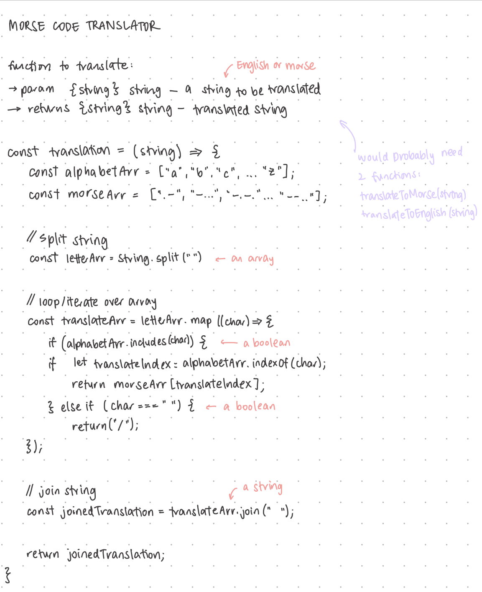

# Morse Code Translator

A project to create a translator, using HTML, CSS, and JavaScript, between Morse code and English.

## Planning

Upon starting this project, I decided to set up the overall design of the page first just to remove a process from my thoughts. My design goals were quite simple in that I wanted my nology projects to feel united visually — as if it were a suite of projects.

I then hand-wrote a draft of the logic I would need to achieve to make this translator work.

## Logic

For the interactivity of this app, I wanted to create a translator that gave instant feedback as the user is typing. I felt that this particular behviour for the app would be best for the user experience as there is nothing else that is stimulating visually. If users had to finish their input and submit their string, they would have no indication that the app is doing anything as they type. Because of this, there might be an unpleasant feeling in the lead-up to getting their result. Therefore, returning a translation instantly would be the best solution to this problem.

I felt this project would be a good opportunity to further practise on abstraction to break down a big problem into a set of smaller tasks.

Input: a string of text in either English or Morse
Output: a string of text in Morse of English (i.e., opposite to the input string)

Tasks:

-   Have two arrays: one with English alphabet, and one with morse equivalent.
-   If the inputted character matches the character in the array, return the equivalent character of the other array at that index.
-   For English, words are separated with a space.
-   For Morse code, characters are separated with a space, and words are separated with a '/'.
-   Display the returned character to the DOM.

## Coding

I created three scripts to keep my code modular and further separate the roles of the functions. Whilst working on my translation script, I made frequent use of console.log to make sure I was getting the correct result from my expressions.

This project was helpful in consolidating my knowledge and skills using Objects and iterators within JavaScript.

## Refactor

Upon having a code review, it was suggested to refactor my JavaScript and further break down the functions. This was a good challenge for me, especially to think about how I could use one function to translate both ways. I decided to use ternary operators to achieve this goal. I also included unit testing for my functions to make sure that it executed the way it was supposed to. However I do think that if I did Test-Driven Development and started with writing tests, the tests would be less biased.
